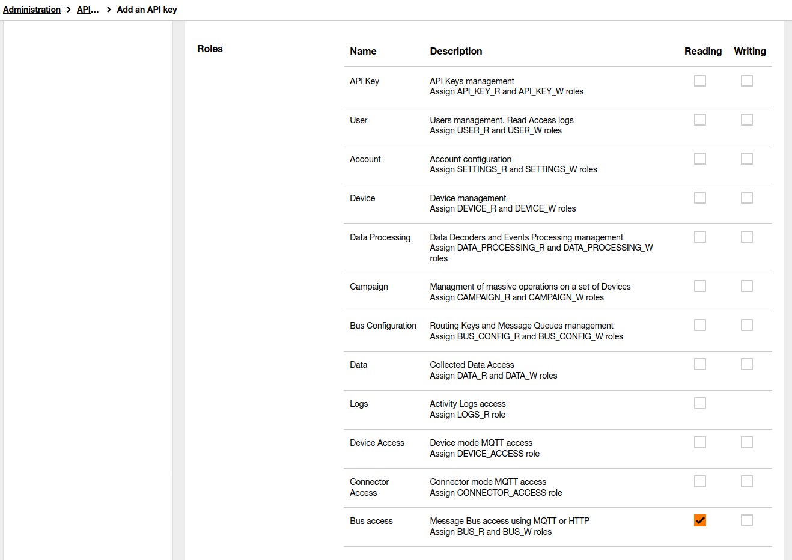

## Table of contents
* [General info](general-info)
* [Technologies](technologies)
* [Requirements](requirements)
* [Getting the installation package](#getting-the-installation-package)
* [Installation](#installation)
* [Configuration](configuration)
    * [Live objects side](live-objects-side)
    * [Google Cloud Platform](google-cloud-platform)
    * [Create google PubSub queue](create-google-pubsub-queue)
    * [Connector](connector)
* [Launching](launching)
    * [Installation](installation)

## General info
This repository contains everything you need to create 'Live Objects to Google PubSub' connector. This project is intended for Live Objects users wishing to explore integration patterns with Google and for organizations already running business logic on Google planning to work on events from IoT devices sourced via Live Objects.

Main feature is: 
* **messages synchronization** - every message which will be send from device to Live Objects will appear in Google PubSub

One connector can handle one Live Objects account and one PubSub Service. 

It can be many instances of connector per Live Objects account.

The software is an open source toolbox which has to be integrated into an end to end solution. The ordering of messages is not guaranteed to be preserved.
Live Objects platform supports load balancing between multiple MQTT subscribers.

## Technologies
* Java 8
* Spring Boot 2.4.4

## Requirements
In order to run the connector you need to have:
* **Live Objects account**
  * API key which can access the queue
  * MQTT fifo queue (both MQTT fifo queue and API key generation is described in the [user guide](https://liveobjects.orange-business.com/#/cms/ressources-guide-utilisateur/))
* **Google Cloud Platform account**
  * Service account private key
  * PubSub Service enabled
* **Development tools (only when building the package)**
   * Java and supporting IDE (e.g. IntelliJ, Eclipse)
   * Apache Maven

## Getting the installation package

The installation package can be acquired in one of two ways:

### Release

It can be downloaded from https://github.com/DatavenueLiveObjects/GoogleCloud_LO_connector_to_install_on_GCP/releases

### Building

It can be created by running the command:
```
mvn clean package -Prelease
```
After running this command, the file  `mqtt2sqs-[VERSION].zip` will be created in the target directory.

## Installation

The file downloaded/created above should be placed where the connector will be started, and then unpacked. You can deploy this connector wherever you want (local server, cloud provider etc.).

After unpacking the archive, you should get a structure similar to this:
```
bin/
conf/
data/
lib/
```

## Configuration

### Live objects side

#### Generate Live Objects API key
Login to Live Objects Web Portal and go to **Administration** -> **API keys**  
  

Click **Add** button and fill fields.  


To  validate  the  creation  of  the  key,  click  on  the **Create** button.  Your  key  is  generated  in  the form of an alphanumeric sequence and a QR code.

### Google Cloud Platform

#### Create service account private key

Please generate service account private key json file. Generated file should be placed in project, default location is ```credentials/auth.json```.
You can find information how to generate such file [here](https://cloud.google.com/docs/authentication/production#create_service_account)

### Create google PubSub queue

How to generate Google PubSub queue is described [here](https://cloud.google.com/pubsub/docs/quickstart-console) 

### Connector
All configuration can be found in **application.yaml** file located in ```src/main/resources```

```
1     lo:
2       hostname: liveobjects.orange-business.com
3       api-key: YOUR_API_KEY
4       connection-timeout: 30000
5       topics:
6         - MESSAGES_TOPIC_1
7         - MESSAGES_TOPIC_2
8       message-qos: 1
9       synchronization-interval: 60000
10      mqtt-persistence-dir: ${basedir:.}/temp/
11      keep-alive-interval-seconds: 30
12      message-batch-size: 10
13      task-queue-size: 150000
14      thread-pool-size: 40
15      keep-alive-time: 10
16    
17    google:
18      pub-sub:
19        project-id: YOUR_PROJECT_ID
20        topic-id: YOUR_TOPIC_ID
21        auth-file: credentials/auth.json
22        message-batch-size: 10
23        message-sending-fixed-delay: 1000
24        initial-retry-delay: 100
25        retry-delay-multiplier: 1.3
26        max-retry-delay: 60000
27        initial-rpc-timeout: 5000
28        rpc-timeout-multiplier: 1.0
29        max-rpc-timeout: 600000
30        total-timeout: 600000
31    
32    management:
33      endpoints:
34        web:
35          exposure:
36            include: info, health, metrics
```


You can change all values but the most important lines are:


**2** - Live Objects hostname  
**3** - Live Objects API key with at least BUS_R role  
**4** - This value, measured in miliseconds, defines the maximum time interval the client will wait for the network connection to the MQTT server to be established  
**5** - Names of the Live Objects MQTT queues  
**9** - How ofter messages will be synchronized im milliseconds  
**11** - This value, measured in seconds, defines the maximum time interval between messages sent or received. It enables the client to detect if the server is no longer available, without having to wait for the TCP/IP timeout. The client will ensure that at least one message travels across the network within each keep alive period.  In the absence of a data-related message during the time period, the client sends a very small "ping" message, which the server will acknowledge. A value of 0 disables keepalive processing in the client.    
**19** - Project ID  
**20** - Google PubSub topic ID.  
**21** - Related path to json file with service account private key.  
**23** - message-sending-fixed-delay - How often messages will be sent to DIS in milliseconds

#### Logging
Logging configuration can be found in **logback.xml** file located in src/main/resources. You can find more information about how to configure your logs [here](http://logback.qos.ch/manual/configuration.html)


## Launching
In order to run the connector, use the `app.sh` file for linux or `app.bat` if you are using windows. These files are located in the `bin/` directory.

### Installation

You can deploy this connector wherever you want (local server, cloud provider etc.)
